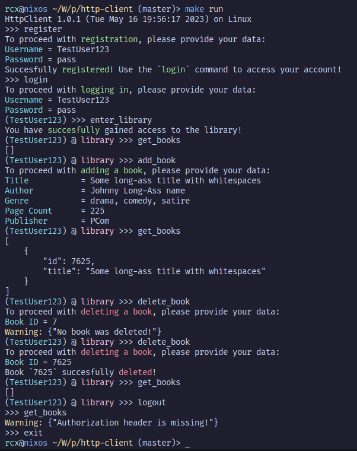
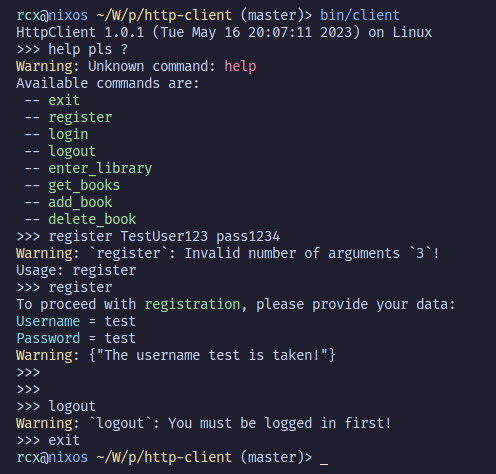

##### Copyright (c) 2023, Robert-Ioan Constantinescu

# HttpClient - Assignment for PCom

## What is this?

This is a simple web client written in the C programming language, that aims
to provide an interactive command line for interfacing with a web server
provided by the [PCom](https://ocw.cs.pub.ro/courses/pc) team.

## How can I run this?

To install the project, simply run
```
$ make
```
in the project's root, then run the client either with
```
$ make run
```
, or with
```
$ bin/client
```

## What can I do with this?

As long as the [team](https://ocw.cs.pub.ro/courses/pc) decides to keep their
web server online, you can register accounts, log in into them, or *access*
your **library**, where you can *add*, *view*, or *delete* books. These *books*
have no content, and only serve to let the student play with *GET*, *POST*, or
*DELETE* requests.

Here is an example of playing around with the program:


As you can see, when the client opens, the user is greeted with a standard
*prompt*, looking like the one from the Python interpreter (`>>>`). After
logging in, or accesing the library, the prompt updates properly, so that the
user can easily deduce if he is logged in, under what username, and if he has
access to the library, without having to scroll.

The behaviour of the interface is similar to a system shell like `bash`, but
lacks features such as auto-completion, and the command history. Still, the
user can still make his way around the program without reading this rant, as
the messages are quite explicit.

#### Here is an example:


As you can see above, no user manual is required, this program is insanely easy
to use.

> **Note!** Maybe I'll also add command descriptions and an actual `help` command, but
> I'm too lazy right now.

## At last, the implementation details

### Part I. The project's structure

Here is a simple schematic depicting how the program works internally, without
going much into the **nitty gritty**:

```
              prints welcome message
             ------------------------> (startup.c)
            /
           / calls parser loop
(client.c) ------------------> (parser.c)        (colors.h) is just for fun :D
 |   ^                               |
 |   |                               |
 |   |                               |
 |   <-------------------------------------------> else, prompt the user again
 |   if a valid command is typed, call
 |   the function in client.c
 |
 |-----> (conn.c)   provides an additional layer over the socket API  
 |
  \----> (parson.c) external JSON library, credits below
```
> **Note!** The `prompt` is actually a global variable in `parser.c`, declared
> as `extern` in the `parser.h` header, and it is directly modified by the
> functions in `client.c` when the needs arise.

### Part II. The nitty gritty

As you can see in the last part, I have decided to design this program with
great modularity in mind, as to avoid the exponential escalation of spaghetti
code.

To achieve this, I have separated the command-line parser from the actual
functions which can be called, and have chosen a standard type definition for
those functions.

To understand this, I find it easier for me to provide an example:
> Adding a new function:
>
> I want to add a new function, that will clear up the terminal. The first step
> is to define it above the `main()` function in `client.c`, with the following
> type:
> ```
> char *client_clear(size_t argc, char **argv);
> ```
> This is necessary, as the parser only knows how to handle functions with this
> definition. The next step is to add it to the `cmds[]` array, along with
> the actual name of the command that the user will type:
> ```
> command_t cmds[] = {
>        ...
>        {.fp = client_clear, .name = "clear"}
> };
> ```
> The final step is to actually implement the function. `argc` and `argv` will
> contain the command arguments given to us by the parser, and the return value
> should be a dinamically allocated `char*`, which can also pass meanings to
> the parser:
> ```
> "Success"          -> Will terminate the program after the function
>                       executes
> "Error: <stuff>"   -> The program will terminate, and "Error: <stuff>"
>                       will be printed out in red
> "Warning: <stuff>" -> The program will continue execution, and
>                       "Warning: <stuff>" will be printed out in yellow.
>
> anything else, including NULL will not affect anything.
> ```
> This is all there is to the parser and adding new functions, now let's get to
> the JSON library

As I have chosen to write this program in C, I needed to use a **Json** library
to avoid the headaches of manually handling Json's, so for that I'm using
[parson](https://github.com/kgabis/parson) by [kgabis](https://github.com/kgabis).

The main functions I'm using from `parson` are `json_value_init_object()`,
which creates an empty Json root, `json_value_get_object(root)` which creates
a wrapper for the root, `json_object_set_string()` which adds (String, String)
pairs to the Json, and the functions used to free the json data afterwards.
I'm also using `json_serialize_to_string_pretty()` to get pretty strings from
the compact Json's the server sends back to the client, in the case of
requesting books.

### Part III. The workflow of my functions

Now, it's time to talk about how most of my functions are designed, as there
is a general pattern to all of them. Here are the usual steps that are getting
executed:

1. Connect to the server, using the `API` defined in `conn.c`
2. Check the command arguments
3. For some commands, optionally check if the user is logged in and/or has
access to his library. (for the login check to pass, the login cookie must be
set to a valid value, and for the library access check, the JWT token must also
be valid)
4. Get more input from the user, and build a message to send to the server,
using functions defined in `conn.c` for the actual message, or `parson.c` for
building Json's
5. Send the message to the server
6. Read the response from the server. If it is an error, return the message,
wrapped in "Warning: \<msg>", or "Error: \<msg>". Else, handle the response
(modify the prompt, or set the JWT token, or do other processing, depending on
the specific function).
7. Clean everything up

## Final words

Big thanks to [kgabis](https://github.com/kgabis) for his
[parson](https://github.com/kgabis/parson) library, and even more thanks to the
[PCom](https://ocw.cs.pub.ro/courses/pc) team for providing a web server to
play around with.

Also, thanks to
[RabaDabaDoba](https://gist.github.com/RabaDabaDoba/145049536f815903c79944599c6f952a)
for providing `colors.h`, that I have used extensively to provide prettier outputs.
